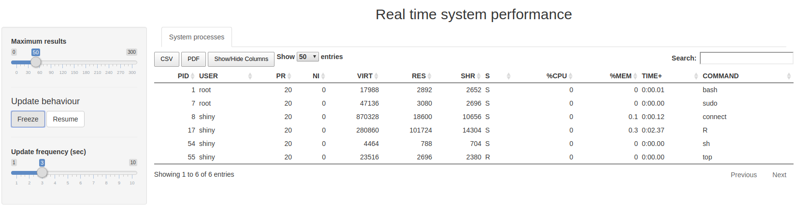

### Real Time Performance Dashboard in R-shiny

This application displays all the system processes on the machine the application is running at. It refreshes automatically after a specified time itnerval. You can also choose to freeze the current content, export it to csv, pdf.

[Live dashboard](https://ginberg.shinyapps.io/perf/)

